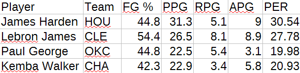
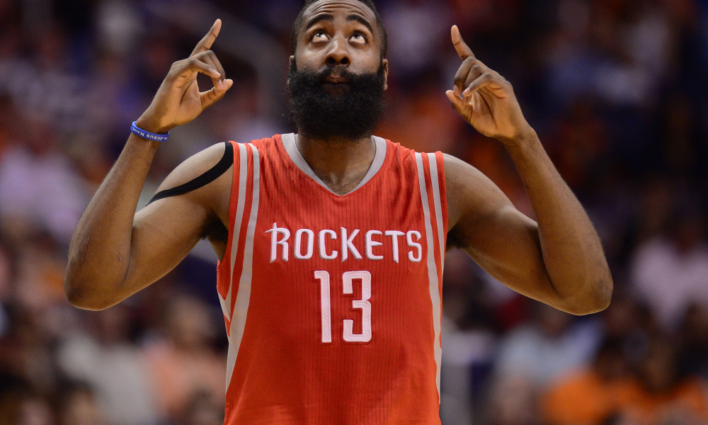

# All-NBA 1st team classifier

The All-NBA Team is an annual National Basketball Association (NBA) honor bestowed on the best players in the league following every NBA season. This is a simple machine learning approach on classifying players based on their stats. 

## Player stats
- FG % (Field goal percentage)
- PPG (Points per game)
- RPG (Rebounds per game)
- APG (Assists per game)
- PER (Player efficiency rating)

## Classifier accuracy
- 70 % on test set (not bad, but could be better)

## 2018 stats
I wanted to see how the classifier does on stats from some players from the 2017/18 season:

Results:
All-NBA 1st team: Lebron James, James Harden
Didn't make it: Paul George, Kemba Walker

James Harden when he realized he's gonna make the All-Nba 1st team:

## ToDo List
- Add more data
- Add more stat attributes (current attributes can't describe how good a player really is)
- Try different model